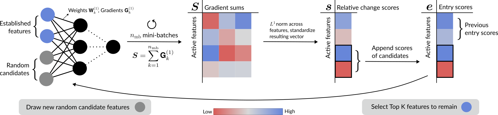

# EntryPrune

An algorithm to select features in neural networks based on rotating input layer neurons. The metric used for pruning measures relative change in first layer weights across a few mini-batches. It is described in the paper "EntryPrune: Neural Network Feature Selection using First Impressions" (https://arxiv.org/abs/2410.02344).



This repository contains the code for EntryPrune in Python along with a basic usage example. 
For a reproduction of the experiments in the paper instructions are given in /experiments/README.md.

Note: The algorithm is implemented in PyTorch and uses CUDA by default. You may encounter bugs when running it on a CPU and experimental results might not replicate exactly. 

## Installation

To install the package, follow these steps:

1. **Clone / Download the repository**:
   ```bash
   git clone https://github.com/flxzimmer/entryprune.git
   cd entryprune
   ```

2. (optional) setup a new virtual environment, for example via
   ```bash
   conda create --name entryprune_env python=3.12.3
   conda activate entryprune_env
   ```

3. **Install the package**:
   ```bash
   pip install .
   ```
   

## Usage

For a basic use case see /examples/basic.py. 


